# Credit Loan Approval Prediction using Azure ML

The ability to accurately predict the approval status of a loan application is crucial for financial institutions to mitigate risk and streamline operations. This project focuses on developing a classification model to predict loan approval (Loan_Status), where 0 indicates 'not approved' and 1 indicates 'approved'.

The dataset utilized in this study is a synthetic dataset inspired by the original Credit Risk dataset from Kaggle and further enriched with variables drawn from Financial Risk for Loan Approval data. This enhanced dataset provides a robust foundation for building a predictive model.

The primary objective of this project is twofold: first, to leverage the capabilities of Azure Automated ML to rapidly identify a high-performing classification model for loan approval prediction. Second, we will explore the use of Azure HyperDrive to conduct a more granular hyperparameter tuning process, aiming to further optimize model performance.

Ultimately, the best-performing model from either Automated ML or HyperDrive training will be deployed as an endpoint, demonstrating a practical application of machine learning in a financial context. This report details the process of data exploration (as needed), model development using both Azure services, evaluation of the resulting models, and the deployment of the chosen model.

## Dataset

This project utilizes a synthetic dataset comprising 45,000 entries and 14 features relevant to credit risk assessment and loan approval. A summary of the dataset's structure and variable types is as follows:

* **Number of Instances:** 45,000
* **Number of Features:** 14

The features included in the dataset are:

* `person_age`: (float64) Age of the loan applicant.
* `person_gender`: (object) Gender of the loan applicant.
* `person_education`: (object) Education level of the loan applicant.
* `person_income`: (float64) Annual income of the loan applicant.
* `person_emp_exp`: (int64) Years of employment experience of the loan applicant.
* `person_home_ownership`: (object) Home ownership status of the loan applicant.
* `loan_amnt`: (float64) The amount of the loan requested.
* `loan_intent`: (object) The stated purpose of the loan.
* `loan_int_rate`: (float64) The interest rate of the loan.
* `loan_percent_income`: (float64) Loan amount as a percentage of the applicant's income.
* `cb_person_cred_hist_length`: (float64) Length of the applicant's credit history (in years).
* `credit_score`: (int64) Credit score of the applicant.
* `previous_loan_defaults_on_file`: (bool) Indicates if the applicant has a history of previous loan defaults.
* `loan_status`: (int64) The target variable indicating loan approval status (0 = not approved, 1 = approved).

This dataset offers a rich set of features, encompassing demographic information, financial details, and credit history, making it suitable for developing a robust loan approval prediction model.

### Task

This project aims to build a predictive model to classify loan applications as either approved or not approved (loan_status). To achieve this, we will leverage a variety of features within the dataset, including the applicant's age (person_age), gender (person_gender), education level (person_education), income (person_income), employment experience (person_emp_exp), home ownership status (person_home_ownership), the requested loan amount (loan_amnt), the stated purpose of the loan (loan_intent), the loan's interest rate (loan_int_rate), the loan amount as a percentage of income (loan_percent_income), the length of their credit history (cb_person_cred_hist_length), their credit score (credit_score), and whether they have a history of previous loan defaults (previous_loan_defaults_on_file). By analyzing these features, the classification models will learn the underlying patterns that determine loan approval, enabling us to predict the loan_status for new applications.

## Automated ML

### AutoML Configuration

| Parameter                     | Value                   | Description                                                                 |
|-------------------------------|-------------------------|-----------------------------------------------------------------------------|
| `experiment_timeout_minutes`  | 20                      | Maximum time in minutes that the experiment should run.                       |
| `max_concurrent_iterations` | 5                       | Maximum number of iterations to run in parallel.                              |
| `primary_metric`            | `AUC_weighted`          | The primary metric to optimize for during model selection.                   |
| `task`                        | `"classification"`        | The type of machine learning task.                                          |
| `label_column_name`         | `"loan_status"`         | The name of the column containing the target variable.                        |
| `enable_early_stopping`     | `True`                  | Flag to enable early termination of poorly performing runs.                   |
| `featurization`               | `'auto'`                | Specifies that featurization should be performed automatically.               |             |

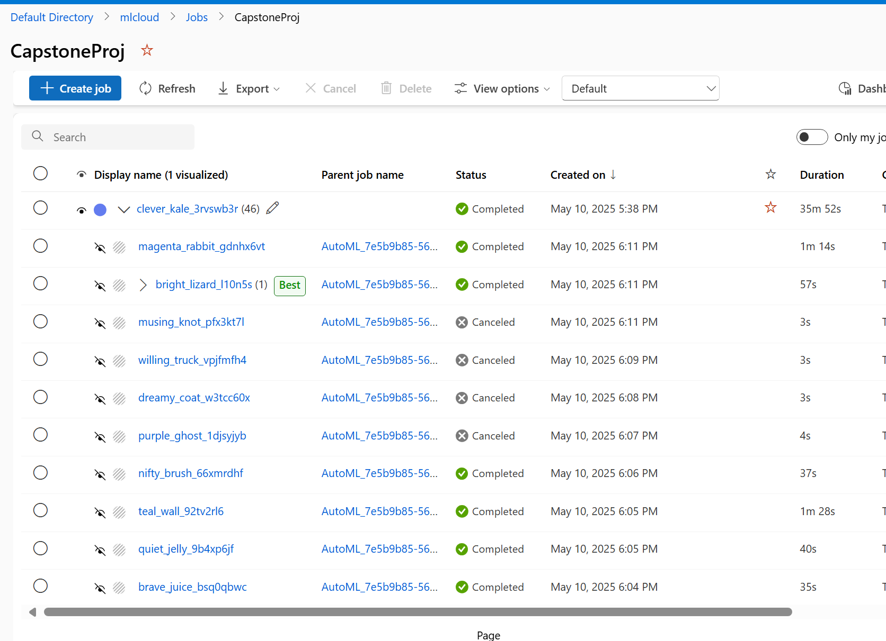 Auto ML Runs

### Results
The Automated ML run's best model was a voting ensemble that included several pipelines. Among them were pipelines featuring a StandardScalerWrapper with an XGBoostClassifier, a MaxAbsScaler with LightGBM, and a StandardScalerWrapper with a RandomForestClassifier. This ensemble approach yielded a strong performance with an AUC score of 0.94612.

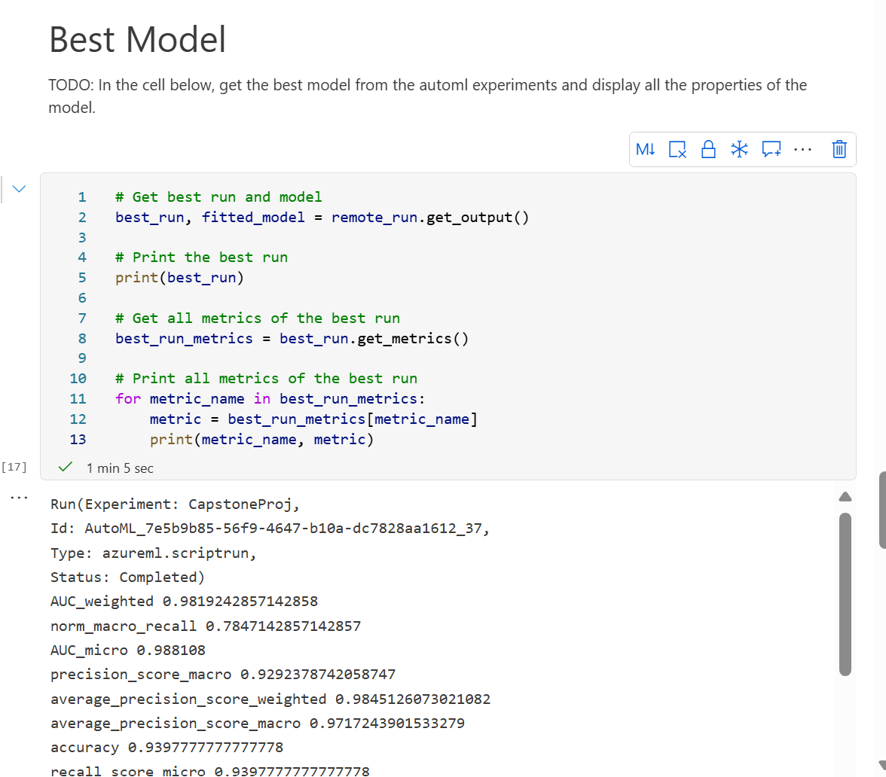 Best AutoML Run

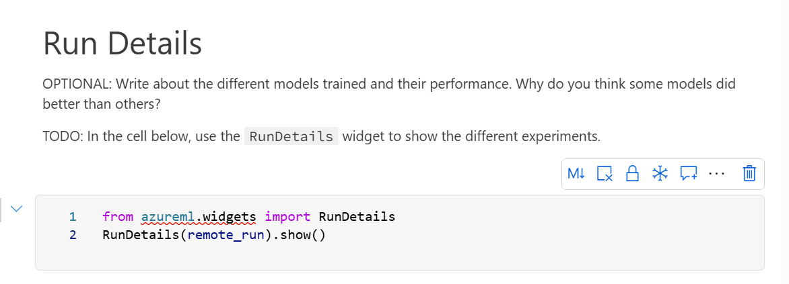 Run Details

## Hyperparameter Tuning
For the HyperDrive experiment, we chose to tune an **XGBoostClassifier**. XGBoost is a gradient boosting algorithm known for its performance and scalability, often achieving state-of-the-art results on structured data classification tasks. We selected it for its ability to handle complex relationships within the loan application features.

To optimize the XGBoost model, we employed **RandomParameterSampling** to explore the hyperparameter space. The key parameters we searched over and their respective ranges were:

* `--learning_rate`: Sampled using a $\text{loguniform}(-3, -1)$ distribution. This explores learning rates on a logarithmic scale between $10^{-3}$ and $10^{-1}$ (0.001 to 0.1), which is often beneficial for finding an appropriate step size during the gradient boosting process.
* `--n_estimators`: Discrete choices of 50, 100, 150, or 200. This parameter controls the number of boosting rounds or trees in the ensemble.
* `--max_depth`: Discrete choices of 3, 4, 5, or 6. This parameter limits the maximum depth of each tree, controlling the complexity of the individual learners.

By randomly sampling from these parameter ranges, HyperDrive systematically explored different configurations of the XGBoost model to identify the one that yields the best performance on our loan approval prediction task.

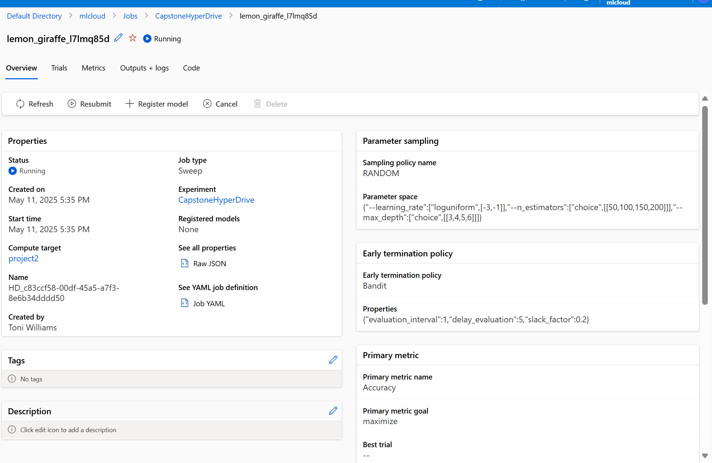 Hyper Drive Job

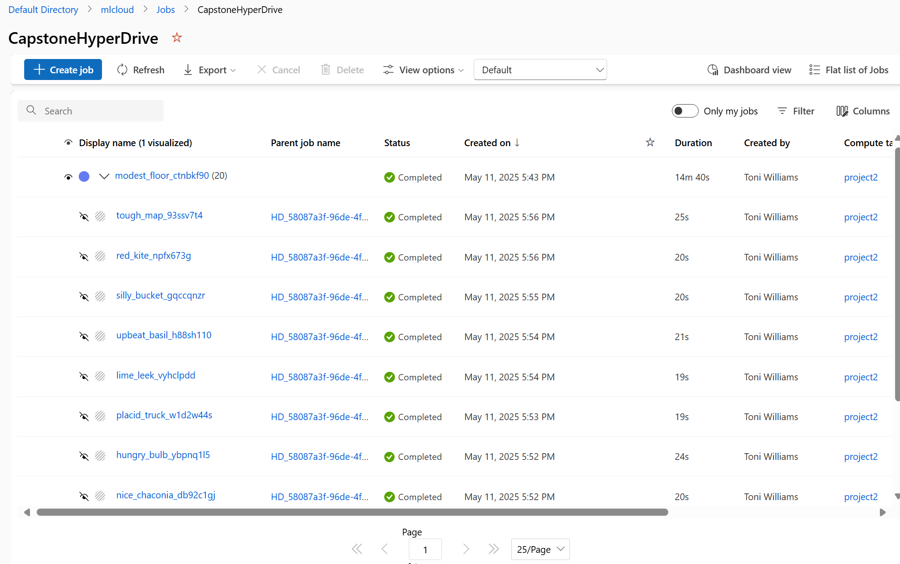 Completed Hyper Drive Run

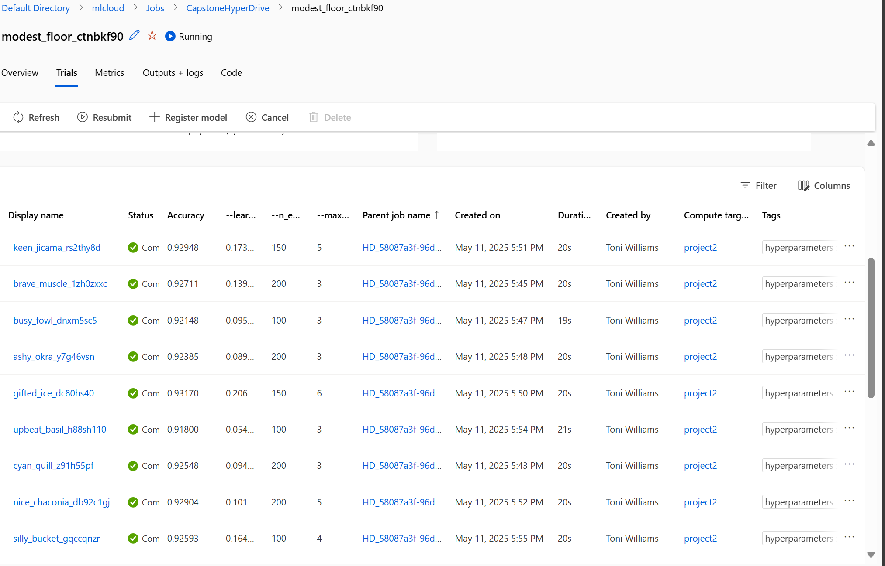 Hyper Drive Trial Runs and Metrics

### Results

The best performing run from the HyperDrive experiment achieved the following metrics with the corresponding hyperparameter values:

* **Learning Rate:** 0.20616888331427718
* **Max Depth:** 6
* **Number of Estimators:** 150
* **Random State:** 1
* **Accuracy:** 0.9317

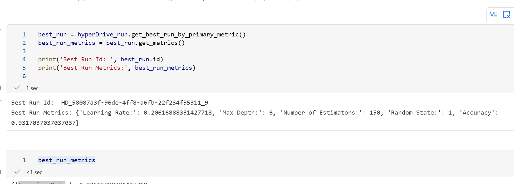 Best Hyper Drive Run

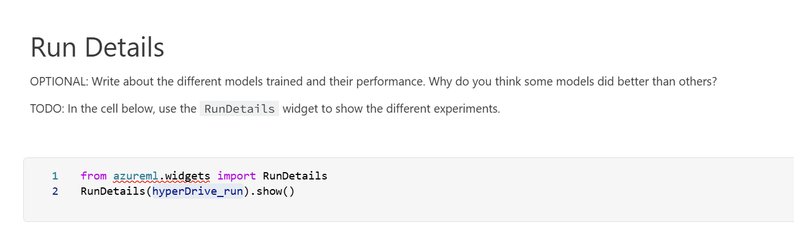 Hyper Drive RunDetails

## Model Deployment
The Automated ML experiment yielded a voting ensemble model that demonstrated superior performance. While both the Automated ML and HyperDrive experiments produced strong results, the Automated ML model was selected for deployment due to its higher accuracy score. A higher accuracy score indicates that the Automated ML model is better at correctly classifying loan applications as approved or not approved, which is a critical factor in a production setting. Therefore, prioritizing accuracy, the Automated ML model was chosen for deployment to ensure the most reliable loan approval predictions.

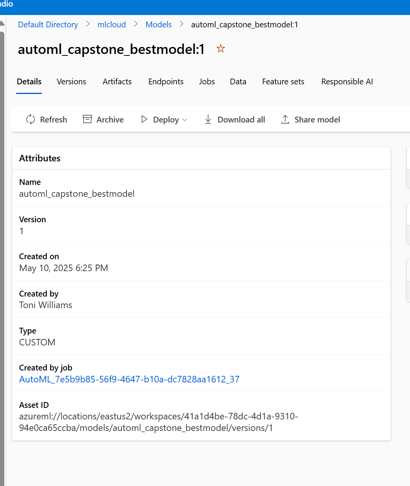 Registered Model

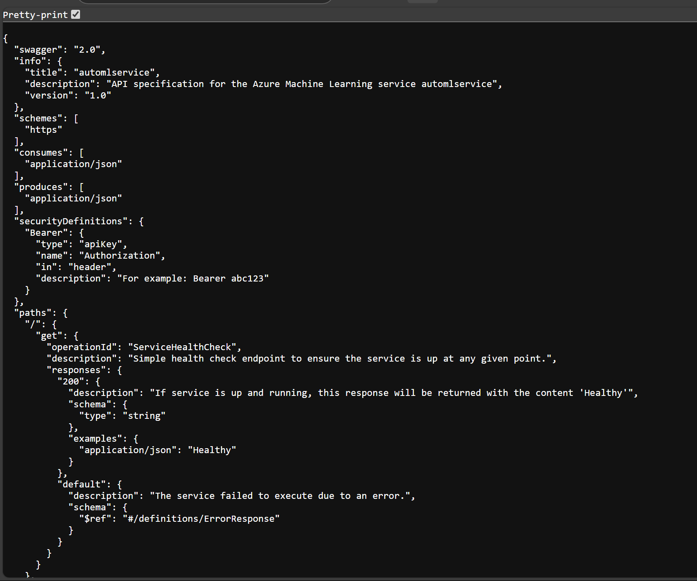 Model Swagger Definition

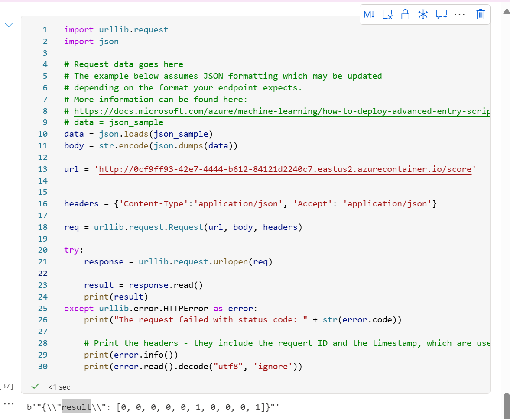 Model Web Service Request and Response

## Screen Recording

[Automated ML Screen Recording](https://drive.google.com/file/d/1B6poXfW_Bozn_4rWqrQcXHFpsD9brWUM/view?usp=sharing)

[Hyper Drive Screen Recording](https://drive.google.com/file/d/1g2MTWZuCv5qHLBxh9RvuKV6B_wvZ30Jn/view?usp=sharing)

